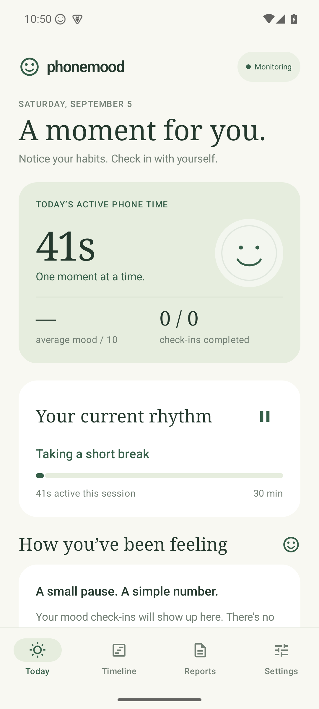

# PhoneMood | Phone Mood Awareness

PhoneMood is a Android app for noticing the relationship between active phone use and self-reported mood. It requires no account, server, telemetry, advertising SDK, or network permission. Usage records, mood ratings, and reports stay on the device.



## Features

- Summarizes active phone time and usage by app.
- Prompts for a 1–10 mood rating after configurable usage intervals.
- Supports notification and floating overlay check-ins, snoozing, dismissal, and pause controls.
- Provides Today, Timeline, period analysis, and daily report views.
- Exports local data as a single JSON file.
- Reconciles data after process death, reboot, and late responses.

PhoneMood is a self-observation tool, not a medical diagnostic system.

## Download

[Download the PhoneMood 1.4.0 debug APK](https://github.com/Xiao-Chen-usc/phonemood/raw/main/PhoneMood-1.4.0-debug.apk)

The debug APK supports Android 10/API 29 or newer. On first use, grant Usage Access, notification, and Display over other apps permissions.

## Build and test

Requirements: JDK 17+, Android SDK 35, and an Android 10/API 29 or newer emulator or device.

```bash
./gradlew :app:assembleDebug
./gradlew :app:testDebugUnitTest
./gradlew :app:lintDebug
```

The debug APK is generated at `app/build/outputs/apk/debug/app-debug.apk`.

For emulator installation and the full device checklist, see [docs/DEVICE_TESTING.md](docs/DEVICE_TESTING.md). For the analysis contract, see [docs/PERIOD_EXPORT_SCHEMA.md](docs/PERIOD_EXPORT_SCHEMA.md) and [docs/ANALYSIS_POLICY_V1.md](docs/ANALYSIS_POLICY_V1.md).

## Data and privacy

PhoneMood does not request the `INTERNET` permission. Data is stored in a local Android database. Reports are exported under `Downloads/PhoneMoodHealth/` and may contain package names, usage durations, and mood ratings.

## Project structure

- `app/src/main/java/com/phonemood/ui/`: Jetpack Compose UI
- `app/src/main/java/com/phonemood/monitoring/`: usage reading and session calculation
- `app/src/main/java/com/phonemood/mood/`: prompts, notifications, and overlays
- `app/src/main/java/com/phonemood/data/`: Room database and repository
- `app/src/main/java/com/phonemood/analysis/`: period statistics and local analysis
- `app/src/test/` and `app/src/androidTest/`: unit and device tests
- `docs/`: design, validation, schemas, examples, and testing documentation

---

# PhoneMood｜手机情绪觉察

PhoneMood 是一个完全本地运行的 Android 应用，用来帮助你观察「手机主动使用时间」与「自我报告情绪」之间的关系。它不需要账号、服务器、遥测、广告 SDK 或网络权限，所有记录和报告都保存在手机本地。


## 功能

- 统计主动使用时间和各 App 使用情况。
- 按使用时长触发 1–10 分情绪自评提醒。
- 支持通知、悬浮卡片、稍后提醒、关闭和暂停监控。
- 查看 Today、Timeline、周期分析和每日报告。
- 将本地数据导出为单个 JSON 文件。
- 支持进程重启、手机重启和延迟响应后的数据恢复。

PhoneMood 是自我观察工具，不是医疗诊断工具，也不会根据手机使用时间推断心理状况。

## 下载安装包

[下载 PhoneMood 1.4.0 debug APK](https://github.com/Xiao-Chen-usc/phonemood/raw/main/PhoneMood-1.4.0-debug.apk)

安装包适用于 Android 10（API 29）或更高版本。首次使用需要授予使用情况访问、通知和显示在其他应用上层权限。

## 构建与测试

要求：JDK 17 或更高版本、Android SDK 35，以及 Android 10（API 29）或更高版本的模拟器或实体设备。

```bash
./gradlew :app:assembleDebug
./gradlew :app:testDebugUnitTest
./gradlew :app:lintDebug
```

APK 输出位置：`app/build/outputs/apk/debug/app-debug.apk`。

电脑安装和完整设备测试清单见 [docs/DEVICE_TESTING.md](docs/DEVICE_TESTING.md)；分析数据契约见 [docs/PERIOD_EXPORT_SCHEMA.md](docs/PERIOD_EXPORT_SCHEMA.md) 和 [docs/ANALYSIS_POLICY_V1.md](docs/ANALYSIS_POLICY_V1.md)。

## 数据与隐私

PhoneMood 不申请 `INTERNET` 权限。数据保存在 Android 本地数据库中，报告导出到 `Downloads/PhoneMoodHealth/`。报告可能包含 App 包名、使用时间和情绪评分，分享时请确认接收方和范围。

## 项目结构

- `app/src/main/java/com/phonemood/ui/`：Compose 用户界面
- `app/src/main/java/com/phonemood/monitoring/`：使用情况读取和 session 计算
- `app/src/main/java/com/phonemood/mood/`：情绪提醒、通知和悬浮卡片
- `app/src/main/java/com/phonemood/data/`：Room 数据库和数据仓库
- `app/src/main/java/com/phonemood/analysis/`：周期统计和本地分析
- `app/src/test/` 与 `app/src/androidTest/`：单元测试和设备测试
- `docs/`：设计、验证、schema、示例和测试文档
