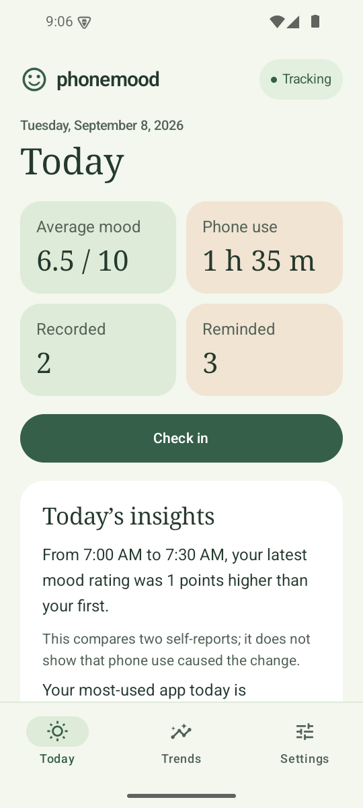
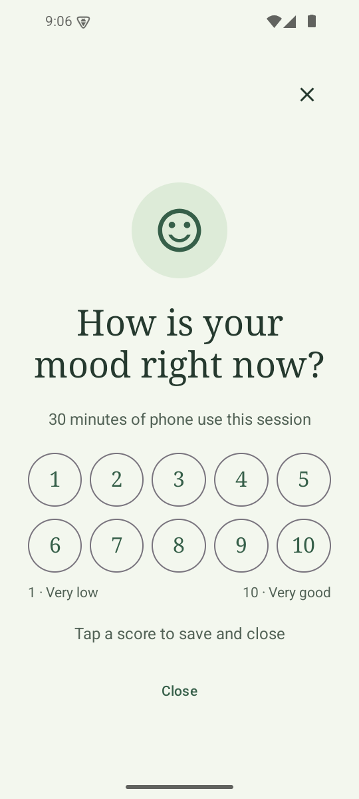
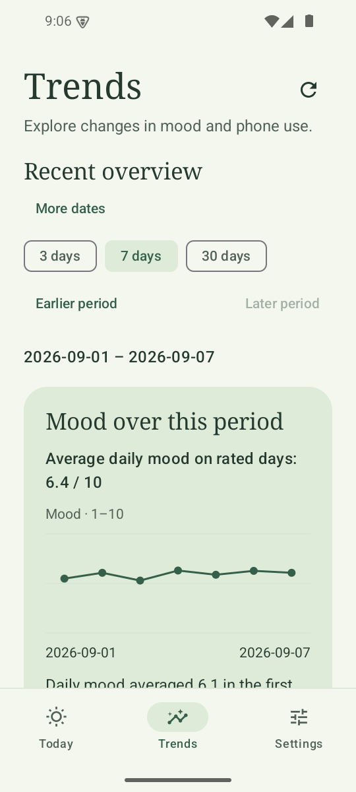

# PhoneMood｜手机情绪觉察

*English version: [README.md](README.md)*

**手机使用、情绪与日常自我反思**

[全部文档](docs/README.zh-CN.md) · [文献综述](docs/LITERATURE_REVIEW.zh-CN.md) · [下载 Android 原型](https://github.com/Xiao-Chen-usc/phonemood/raw/main/PhoneMood-1.4.0-debug.apk)

## 目录

| 章节 | 内容 |
|---|---|
| [我为什么开发 PhoneMood](#我为什么开发-phonemood) | 动机，以及背后的测量问题 |
| [研究问题](#研究问题) | 这个原型想要考察的三个问题 |
| [文献与测量背景](#文献与测量背景) | 设计如何从已发表的研究推导而来——完整的[文献综述](docs/LITERATURE_REVIEW.zh-CN.md) |
| [已实现功能](#已实现功能) | 记录、心情提醒、本地分析、导出 |
| [可检查的项目贡献](#可检查的项目贡献) | 各项设计决定，每一项都链接到实现它的代码 |
| [验证与局限](#验证与局限) | 哪些已经过测试，哪些**尚未**确立 |
| [下一步研究](#下一步研究) | 拟议的评估方案，不是已完成的研究 |
| [作者与个人贡献](#作者与个人贡献) | 我的角色，以及合著的 PISA 2022 预印本 |
| [下载、构建与数据隐私](#下载构建与数据隐私) | 安装 APK、从源码构建、阅读数据格式 |

**设计文档**（[索引，中英双语](docs/README.zh-CN.md)）——
[文献综述](docs/LITERATURE_REVIEW.zh-CN.md) ·
[总体设计](docs/HIGH_LEVEL_DESIGN.zh-CN.md) ·
[本地分析设计](docs/FREE_ANALYSIS_HIGH_LEVEL_DESIGN.zh-CN.md) ·
[统计策略](docs/ANALYSIS_POLICY_V1.zh-CN.md) ·
[导出 schema](docs/PERIOD_EXPORT_SCHEMA.zh-CN.md) ·
[验证记录](docs/VALIDATION.zh-CN.md)

PhoneMood 是一个 Android 原型，把自动记录的手机及 App 使用情况与简短的情绪自评结合起来。它起源于对日常数字生活中情绪困扰的关注，以及一个测量问题：如果人们不能准确回忆自己的使用情况，我们该如何研究手机使用与情绪体验的关系？

项目有两个目标：为更细致的个体内研究提供数据，包括探索可能不利的关联；同时帮助使用者觉察自己的手机和 App 使用模式。

**当前阶段：**软件原型正在小范围试用，已有本地统计分析和固定摘要。AI 辅助解读属于后续方向；尚未报告正式参与者研究结果或改善心理健康、学习的效果证据。

| 1. 查看今日记录 | 2. 填写当下情绪 | 3. 回顾一段时间的变化 |
| :---: | :---: | :---: |
| <a href="docs/screenshots/demo-today-1.4.png"></a> | <a href="docs/screenshots/demo-mood-check-in-1.4.png"></a> | <a href="docs/screenshots/demo-trends-1.4.png"></a> |
| 一起查看用时、情绪和自评完成情况。 | 记录此刻的感受。 | 按所选时段观察每日情绪变化。 |

*截图来自 Android 原型的英文界面，使用合成演示数据，不代表参与者研究结果。点击图片可放大；[截图说明](docs/screenshots/README.zh-CN.md)。*

## 我为什么开发 PhoneMood

我的出发点是关注手机使用、社交媒体与情绪困扰之间的关系，包括抑郁症状和压力。已有研究报告了这些关联，但关联的大小及解释会随测量方式和研究人群而变化。因此，**我们究竟测量了什么，又在什么时候测量**，成为这个项目的核心问题。[Thomée 等，2011](https://pubmed.ncbi.nlm.nih.gov/21281471/) · [Lin 等，2016](https://pubmed.ncbi.nlm.nih.gov/26783723/) · [Orben 与 Przybylski，2019](https://doi.org/10.1038/s41562-018-0506-1)

我参与合著了[基于 PISA 2022、研究加拿大与香港青少年睡前数字自我调节和情绪控制关系的论文](https://www.preprints.org/manuscript/202609.0400/v1)，目前为尚未经过同行评审的预印本。论文的局限部分指出了依赖自报、以单个题目测量数字自我调节的问题，并提出加入手机日志等行为测量。PhoneMood 延伸了这一测量方向：自动记录使用情况，并收集接近使用时点的情绪报告，观察日常生活中的个体内变化。论文中的情绪控制与 App 记录的即时情绪仍是不同构念。

事后估计可能遗漏实际使用中的部分特征，尤其是简短、重复的查看。有些操作具有习惯性，未经过充分觉察，也就更难在事后准确重建。将自报与设备记录比较的研究，说明使用估计本身也需要验证。[Andrews 等，2015](https://journals.plos.org/plosone/article?id=10.1371/journal.pone.0139004) · [Oulasvirta 等，2012](https://doi.org/10.1007/s00779-011-0412-2)

因此，我开发 PhoneMood，让行为记录与主观体验在时间上更接近。对研究而言，它提供了观察粗略使用估计可能掩盖的模式的机会；对使用者而言，它让日常行为更可见，包括可能与较差情绪相伴的 App 使用模式。项目希望支持研究和觉察，记录本身不能证明某个 App 造成了伤害。

## 研究问题

1. **测量：**记录的手机及 App 使用与人们的回忆有多一致？按使用时长触发的情绪提示遗漏了哪些体验？
2. **行为与情绪：**在同一个人的记录中，考虑时序、此前评分和数据覆盖后，整体使用模式及具体 App 用时与情绪有怎样的关联？
3. **个人觉察：**回顾这些记录能否帮助使用者识别习惯性模式、注意可能不利的关联，并提出值得进一步了解的问题或调整？

整体手机使用与具体 App 使用是相互关联的分析层面：App 用时包含在总用时中，不能直接作为两个独立作用相加。[文献综述](docs/LITERATURE_REVIEW.zh-CN.md) 解释了这种区别，也讨论情绪状态影响后续使用的可能性。

## 文献与测量背景

[英文综述](docs/LITERATURE_REVIEW.zh-CN.md) 围绕六个主题展开：情绪困扰与数字行为、整体使用与具体 App、测量效度、习惯性查看与觉察、行为记录与即时自评的结合，以及反馈的研究和个人价值。其中纳入了我参与的预印本，AI 则作为后续延伸单独讨论。

核心方法选择是：**行为由设备自动记录，主观体验由使用者报告。**日志可以减少对使用回忆的依赖，但不能直接测量抑郁、压力、意图或一次使用的意义。PhoneMood 当前只有单项情绪自评，并未测量上述所有构念。

## 已实现功能

- 记录前台活跃使用片段和各 App 用时。
- 按可配置的累计活跃使用时长触发 1–10 分情绪自评。
- 支持通知、可选悬浮卡片、稍后提醒、关闭和暂停。
- 支持单日和周期回顾、探索性关联分析及 JSON 导出。
- 包含监测中断后的数据核对与迟答处理逻辑。
- 本地运行，提供中英界面，无需账号或服务器。

这里的 **active phone use**（界面中也称“主动使用时间”）指监测规则计入的前台活跃使用，不意味着有意识或有目的地使用。应用也不判断某次操作是否属于潜意识行为。

## 可检查的项目贡献

本仓库提供可运行的记录界面、明确的测量规则，以及保留分析依据的数据处理和导出流程。

| 设计选择 | 对解释数据的意义 | 实现／文档 |
|---|---|---|
| 区分前台活跃使用与会话经过时间 | 锁屏中断不应被计为活跃使用。 | [会话引擎](app/src/main/java/com/phonemood/monitoring/SessionEngine.kt) |
| 保留未答、实际回答时间与监测缺口 | 解释结果时仍能看到缺失与时序问题。 | [数据构造](app/src/main/java/com/phonemood/analysis/PeriodDataset.kt) |
| 分析会话内变化和有条件的 App 关联 | 明确分析所回答的问题，避免用简单均值代替。 | [统计引擎](app/src/main/java/com/phonemood/analysis/StatisticalEngine.kt) · [统计策略](docs/ANALYSIS_POLICY_V1.zh-CN.md) |
| 一起导出观测、模型输入和质量信息 | 读者可以追溯发现背后的记录与假设。 | [导出规格](docs/PERIOD_EXPORT_SCHEMA.zh-CN.md) · [合成示例](docs/examples/implemented-exports/README.zh-CN.md) |

## 验证与局限

| 证据类型 | 当前文档状态 |
|---|---|
| 初版工程验证 | [9 月 5 日报告](docs/VALIDATION.zh-CN.md) 记录 **1.0.0** 的构建、单元测试、设备测试、lint 和模拟器检查，不能作为后续版本的完整验证。 |
| 后续分析实现 | 仓库包含[分析测试](app/src/test/java/com/phonemood/analysis/AnalysisTest.kt)、schema 检查和明确标注的合成导出，用于检查软件行为。 |
| 早期使用 | 据项目作者说明，目前正在小范围试用；人数、流程和发现尚未在仓库中记录。 |
| 长期可靠性与效果 | 实体设备长期验证仍待完成。尚未报告正式可用性研究结果、情绪题目的心理测量验证或教育／临床效果。 |

单项情绪评分不能代表注意力、执行功能、ADHD 症状或学习效果。按使用行为触发的评分缺少真正的非使用时段情绪基线，未回答也可能具有选择性。睡眠、压力、线下活动和 App 内具体内容没有被测量。统计结果属于探索性关联；小样本和观测间依赖会限制不确定性估计。产品展示门槛不是临床界值，也不能保证统计信息充足。

[认知可访问性设计文档](docs/ADHD_FRIENDLY_UI.zh-CN.md) 描述的是界面设计假设，尚未证明其对 ADHD 用户的有效性。PhoneMood 是自我观察原型，不提出诊断或治疗主张。

## 下一步研究

1. **评估测量：**比较使用估计与实际记录，验证设备覆盖、情绪题目和提示时序；考虑补充采样，以覆盖简短查看和没有持续使用的时段。
2. **研究个体内模式：**考察手机／App 使用与情绪的关联，明确处理此前情绪、缺失、时段和重复观测。
3. **评估个人觉察：**检查回顾记录是否帮助使用者识别自己的模式、区分关联与因果；后续可用相同输入比较固定摘要与 AI 辅助解读。

这些是当前小范围试用之后的拟议研究，具体比较方式见[综述中的研究方向](docs/LITERATURE_REVIEW.zh-CN.md#proposed-study-directions)，不表示已获正式研究批准或完成评估。

## 作者与个人贡献

[**Xiao Chen**](https://github.com/Xiao-Chen-usc) 负责项目构思、研究问题、产品与交互设计、统计分析方案和软件开发实现。项目也是探索教育、心理与 AI 交叉研究方向的一部分。

上述 PISA 论文的[作者贡献声明](https://www.preprints.org/frontend/manuscript/d6ec2b35543ba2f04de356b22a522e61/download_pub#page=17) 列明了 Xiao 在研究方法、软件、数据分析（formal analysis）与研究实施（investigation）方面的贡献。

本 README 与文献综述使用了 AI 辅助起草和修改，并依据所链接的出版物或作者公开原文核查引文。文档制作中的 AI 辅助与应用运行时的行为不同；应用自身不调用 AI 模型。

## 下载、构建与数据隐私

[下载 PhoneMood 1.4.0 debug APK](https://github.com/Xiao-Chen-usc/phonemood/raw/main/PhoneMood-1.4.0-debug.apk)。适用于 Android 10/API 29 或更高版本。记录使用情况需要 Usage Access，通知提醒需要通知权限，悬浮卡片需要“显示在其他应用上层”权限。下载的 APK 是打包快照，可能与当前源码的后续修改不同。

构建需要 JDK 17+、Android SDK 35，以及 Android 10+ 模拟器或设备：

```bash
./gradlew :app:assembleDebug
./gradlew :app:testDebugUnitTest
./gradlew :app:lintDebug
```

输出：`app/build/outputs/apk/debug/app-debug.apk`。[设备检查清单](docs/DEVICE_TESTING.zh-CN.md) 列出测试场景。已提交的 1.4.0 发布源码见 [`45d9037`](https://github.com/Xiao-Chen-usc/phonemood/commit/45d9037)；报告新测试时应记录实际提交与本地改动。

应用不申请 `INTERNET` 权限，记录保存在本地 Room 数据库中。`Downloads/PhoneMoodHealth/` 中的导出可能包含 App 标识、时间戳、使用时长和情绪评分。主动导出并分享后，该副本适用接收方或所选服务的数据规则；应用不会自动向外部 AI 上传。

源码入口：[界面](app/src/main/java/com/phonemood/ui/) · [监测](app/src/main/java/com/phonemood/monitoring/) · [情绪提醒](app/src/main/java/com/phonemood/mood/) · [存储](app/src/main/java/com/phonemood/data/) · [分析](app/src/main/java/com/phonemood/analysis/) · [单元测试](app/src/test/) · [设备测试](app/src/androidTest/) · [设计文档](docs/)
