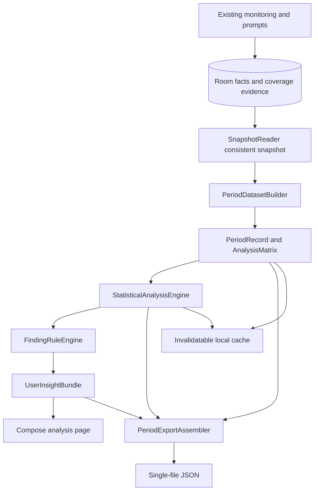

# PhoneMood Free Local Analysis: High-Level Design

*Chinese version: [FREE_ANALYSIS_HIGH_LEVEL_DESIGN.zh-CN.md](FREE_ANALYSIS_HIGH_LEVEL_DESIGN.zh-CN.md)*

Status: shipped in Android 1.4.0. Last updated 2026-09-06. The three models, the analysis page and
the single-file JSON export are all implemented. The released fields are governed by
[Export 2.0](PERIOD_EXPORT_SCHEMA.md), and the released parameters by
[Analysis Policy 1.0](ANALYSIS_POLICY_V1.md). What follows preserves the design reasoning;
candidate parameters and the phase plan have since converged into those two specifications.

Basis: [User Stories](FREE_TIER_USER_STORIES.md), [Period export design](PERIOD_EXPORT_SCHEMA.md),
[JSON Schema](schemas/phonemood-period-v2.schema.json). This design extends the existing Android
app; [HIGH_LEVEL_DESIGN.md](HIGH_LEVEL_DESIGN.md) continues to describe the recording, session and
prompt fundamentals.

## 1. Delivery goal

The user opens the analysis page and sees, directly, the insights the app has derived from its
existing phone-use records and mood ratings. The page supports rolling 7 and 30 days, each
containing:

1. Total phone use, daily average, typical range, and the daily trend.
2. The tendency of mood to change as continuous use lengthens **within one session**.
3. At most three sufficiently supported apps and their extra mood change relative to other apps.

Computation, filtering and interpretation all run locally: descriptive statistics / basic
regression → fixed rules → English and Chinese templates. The user can export one self-contained
JSON for the selected period, for analysis by an external AI or statistical tool. No membership,
payment, AI service, chat or cloud upload is built at this time.

## 2. Key design decisions

Most recent product adjustment: aim for a *useful early tendency*. Twenty valid mood ratings start
a computable basic association analysis. Seven valid dates, thirty ratings and a fixed pair count
are not required, and p/FDR significance does not block a preliminary result from being displayed.
Real data, computational correctness and a "preliminary tendency" label are all retained; when
something is genuinely not estimable, the reason is still explained. Today shows today's data, and
at the same threshold may also offer a today-only exploratory association.

| Item | Decision |
|---|---|
| Data source | Room raw facts and already-rebuilt segments. Stitching daily JSON files together as an analysis source is not permitted |
| Period | The last 7/30 calendar days in the reporting time zone, including today up to the snapshot time |
| Mood attribution | Actual answer time. The old daily report keeps its original definition and is not silently changed |
| Behavioural range | The recent-30-minute features are retained for export; the continuous-use model uses cumulative within-session duration; the app model uses the interval between adjacent actual answers, not a fixed 30 minutes |
| One sample row | For the continuous-use model, a rating observation grouped by session; for the app model, one valid before/after rating pair |
| Result consistency | Charts, copy, models and export all share one immutable period snapshot |
| Presentation | Core finding, key numbers, small chart, support level, "see the basis" |
| Caching | Derived data is deletable and recomputable. Statistical results are never treated as a Room fact table |
| Power | The page computes on demand. It does not join the monitoring poll and adds no screen-off timed task |
| Insufficiency and failure | Each analysis topic has its own state; one failed model never blocks the summary or the export |
| Release boundary | Schema 2.0 and analysis policy 1.0 are frozen and shipped with Android 1.4.0; historical drafts are archived separately |

## 3. Overall architecture



Data reading, feature construction, models, rules and UI are layered. The statistical core accepts
only Kotlin data objects and holds no Context, DAO or Compose state, so it can be verified against
fixed samples.

## 4. Integration points with the existing codebase

| Existing module | Change |
|---|---|
| `PhoneMoodApp` | Provides application-scoped instances of AnalysisCoordinator, the cache and the exporter |
| `Repository` | Adds a ranged snapshot entry point; unifies revision updates for analysis-relevant writes |
| `Database.kt` | Adds ranged DAOs, indices and coverage evidence; existing entities and data are preserved |
| `UsageMonitorService` | Keeps adaptive polling, records only the necessary coverage evidence, runs no analysis |
| `SessionEngine` | Remains the source of truth for rebuilding active time; the timing algorithm is not replaced here |
| `MoodNotificationManager` / `MoodOverlayController` | Delivery, missed and presentation changes participate in snapshot revisions, so the response-rate cache cannot go stale |
| `MainActivity` | Adds an "Analysis" entry point and a separate ViewModel, instead of piling more statistics logic onto the root Composable |
| `DailyReportGenerator` | The existing daily report stays compatible; the new period export uses its own class |
| `SettingsStore` | Stores the last 7/30-day choice, purely as an interface preference |

The current `PhoneMoodScreen` subscribes to all segments, sessions and answers, which makes it
unsuitable as a trigger source for statistical computation; the new page reads a dedicated state
flow. The existing Repository's rebuild-history-on-every-poll is a separate performance problem,
and this work avoids adding statistical cost behind it.

Proposed directory layout:

```text
analysis/
  model/             PeriodSnapshot, PeriodRecord, AnalysisRow, AnalysisState
  data/              SnapshotReader, PeriodDatasetBuilder, CoverageResolver
  statistics/        RegressionSolver, CovarianceEstimator, MultipleTesting
  models/            DailyTrendModel, WithinSessionMoodModel, AppExtraChangeModel
  rules/             AnalysisPolicy, FindingRuleEngine, InsightTemplateMapper
  cache/             AnalysisCache
  AnalysisCoordinator.kt
export/
  PeriodExportAssembler.kt
  PeriodExportValidator.kt
  PeriodJsonWriter.kt
ui/analysis/
  AnalysisViewModel.kt, AnalysisScreen.kt, InsightCard.kt
```

## 5. Fact snapshots and concurrency

### 5.1 The read flow

1. On entering the page, switching period or explicitly refreshing, the Coordinator fixes the
   period, the reporting time zone and a request token.
2. If events need catching up, it reuses the Repository's serialized entry point for one
   reconcile — never a second concurrent query alongside the service. On failure it uses the
   existing facts and marks the uncovered tail.
3. Inside one short Room read transaction it reads monitoring state and revision, in-range
   segments, prompts/answers, configuration, gaps, coverage evidence and the minimum context,
   forming an immutable snapshot. **The snapshot never reads data after its generation moment.**
4. After leaving the transaction and the mutex, features, regressions and rules are computed on
   `Dispatchers.Default`. File writing uses `Dispatchers.IO`.
5. Results are filled back only into a page matching the request token and period. An older
   request, even when it finishes, must never overwrite a newer period.

Never fit a model, generate JSON, or wait on a file picker inside the Repository mutex or a Room
transaction. Snapshot and export in-memory objects must not hold references to mutable entity
collections.

### 5.2 Revision semantics

The current `sourceRevision` changes on every successful poll, which makes it unsuitable for
driving a recomputation every 10 seconds. The design keeps the snapshot's `sourceRevision` as a
source identifier, and lets the coordination layer decide the trigger reason and the throttling.

At implementation time, every write that feeds analysis is audited uniformly: answers, event
corrections, configuration, coverage, first notification delivery, first overlay presentation and
missed state. All of these must invalidate the analysis snapshot; pure UI rendering must not. No
cross-database atomicity is assumed between Room and DataStore — analysis configuration follows the
Room configuration facts.

## 6. Coverage evidence and database migration

Today there is only `lastSuccessfulQueryUtc`, a heartbeat and gaps, which cannot reliably
reconstruct the completeness of each historical date. A separate `UsageCoverageEvidence` fact table
is added, via a non-destructive Room 2→3 migration:

| Field | Purpose |
|---|---|
| id | Deterministic evidence ID |
| startUtc / endUtc | The interval this evidence supports |
| observedAtUtc | When the evidence was obtained |
| outcome | Available, unknown, or explicitly not monitored |
| reason | Permission off, paused, recovery too late, query failure, etc. |
| evidenceVersion | Version of the coverage determination |

A successful UsageStats read is only one piece of evidence. CoverageResolver must also combine the
monitoring-enabled intervals, continuity of system event state, known gaps, recovery boundaries and
explainable screen-off intervals, and then conservatively partition into VERIFIED / UNKNOWN /
NOT_MONITORED. **VERIFIED means the app's defined availability evidence was met — it cannot promise
that the system dropped no events.**

The same range may be re-read several times; the evidence source is retained and the Resolver emits
a non-overlapping partition. An explicitly paused interval is never automatically promoted to
VERIFIED by a later query. Where a conflict cannot be resolved, the result is UNKNOWN with the
reason recorded. History from before the upgrade is not backfilled as verified: recorded totals can
still be displayed, but complete-day statistics and models may be insufficient.

The migration adds time-range query indices: segment start/end, answer time, checkpoint time,
configuration time, coverage evidence start/end. The overlap condition is
`start < endBound AND end > startBound`, so segments crossing a period boundary are not missed.
Migration tests prove that existing ratings, prompts, sessions and export records survive.

Coverage evidence writes are batched and merged, rather than keeping one unbounded success record
per poll. Adjacent entries with the same version, same reason and compatible evidence may merge;
a gap must never be swallowed by a merge. **Merging compresses the representation of evidence — it
never raises its credibility.**

## 7. Period construction and features

### 7.1 Descriptive statistics

- 7 or 30 day entries always exist, with today cut at the snapshot time.
- Period total and per-app totals come from clipped segments; zero use and no record are kept
  apart.
- Daily average, median and P25/P75 use only complete, finished days, and store the actual date
  list and denominator alongside.
- The mean rating uses only answers actually made inside the period, never mixing in a late answer
  that merely fired inside it.
- Response rate uses the cohort of checkpoints first delivered inside the period, deduplicated
  across notification and overlay presentation. **All checkpoints must not be used as the
  denominator.**

### 7.2 The analysis matrix

The descriptive features of `[answer - 30min, answer)` are retained for each actual answer, for
JSON export; a regression on that window's total use is no longer the free tier's primary model.
The three models read separately:

| Dataset | Sample unit | Principal fields |
|---|---|---|
| DailyDataset | One complete finished day | True date index, total active minutes |
| SessionMoodDataset | One in-period actual answer, grouped by session | observation_id, session_id, answer time, rating, cumulative session active minutes as of the answer |
| AppTransitionDataset | A pair of adjacent actual answers in the same session | Start/end observation_id, start/end ratings, mood_delta, start/end times, elapsed_ms, total active time in the interval, per-app time, non-counted active time, coverage, inclusion status and reason |

The app TransitionBuilder may construct change only from real before/after answers. It must not
invent a baseline from a checkpoint that was never answered, and must not explain a longer
interval's rating change with the last 30 minutes of use. The continuous-use model does not require
two ratings to be exactly 30 minutes apart.

Segments and answers are sorted by time first and accumulated with a scan/window index, avoiding a
repeated full-history traversal per answer. Window boundaries are clipped and deduplicated; no
segment after the answer, and no final session duration, is used. An app's display name never
participates in the aggregation key.

Pre-period segments needed for recent-observation features extend at most 30 minutes. If an ending
answer inside the period forms a valid app transition with a same-session answer before the period,
context extends to that pair's start point, bounded by the fixed maximum pair gap. The two needs
take the union of what is necessary, never a copy of all history. A transition belongs to the
period containing its ending answer; out-of-period segments are written separately into context and
do not enter period duration summaries. The continuous-use model uses only in-period ratings, but
the cumulative session total as of the answer may include use from before the period; the export
stores that cumulative value and the meaning of its source. Every referenced ID is resolvable
within the single file.

A switch count needs transition/interruption evidence from `raw_events` and must not be guessed
from adjacent clipped segments. Where the current source cannot prove it, the field is null — never
zero. It is an auxiliary export feature, and no switching-factor leaderboard is added here.

## 8. The local statistics engine

### 8.1 Shared execution flow

Modelling uses only recorded data, or data derivable with certainty. There is no measured "natural
mood for the day", sleep, stress, offline activity or in-app content, so none of these are treated
as known covariates. **Any intercept is a statistical parameter, not a natural mood in the absence
of a phone.** The three primary models are retained; the reference material's 60-minute prompt
window, 30/40-rating thresholds and day-fixed-effects primary model are not reinstated.

Sample filtering → variable variation / matrix checks → stable solve → uncertainty → comparison
over the actual range → model-level state and warnings. A failed model returns a structured result
rather than throwing an exception that fails the whole page.

QR is preferred, SVD is available for rank checking, and `(X'X)` is never inverted directly. The
numerical library is settled after verifying the Android build, binary size and benchmarks; v1
needs only small-matrix linear algebra and introduces no general machine-learning framework.
Centring and scaling must be fixed, and coefficients and covariance exported in original units.

Small-sample robust inference and day-clustering details come from the versioned AnalysisPolicy.
The reference's HC3 for 7–19 days and day clustering from 20 days upward are candidate baselines
only: **HC3 does not automatically solve within-day correlation, and 7 days must not be labelled
stable merely because the run succeeded.** The specific small-sample corrections, degrees of
freedom and display thresholds go into pre-release numerical validation.

### 8.2 Daily use trend: simple least squares

With active minutes on complete day *d* as U_d and the true date index as x_d:

```text
U_d = alpha + beta * x_d + error_d
beta_hat = sum((x_d - mean(x)) * (U_d - mean(U)))
           / sum((x_d - mean(x))^2)
period_change = beta_hat * (max(x) - min(x))
```

Output is beta (minutes per day) and period_change (minutes) across the fitted span. Missing days
keep their true distance; today, being unfinished, does not join the fit. Three complete days are
enough to attempt a preliminary trend — it does not depend on 20 mood ratings.

Direction is judged from period_change against a preset minimum display magnitude, so floating-point
error is never written up as a trend. The candidate threshold under discussion is
`max(15 minutes, 0.1 × median daily use)` — a product parameter still to be finalized, **not a
statistical theorem**. An interval crossing zero does not by itself block an early tendency.
Day-by-day deletion refits check whether one day dominates.

### 8.3 Continuous use and mood: within-session regression

Goal: within one continuous use, how does the mood rating typically move as cumulative use time
increases? Differences in starting mood *between* sessions must never be explained as a decline
*within* one session.

For the *j*-th answer in session *s*, with rating y_sj and cumulative active minutes L_sj:

```text
y_sj = alpha_s + beta * L_sj + error_sj
centered_y_sj = y_sj - mean_y_s
centered_L_sj = L_sj - mean_L_s
w_s = 1 / n_s

beta_hat = sum_s(w_s * sum_j(centered_L_sj * centered_y_sj))
           / sum_s(w_s * sum_j(centered_L_sj^2))
```

alpha_s is absorbed by within-session centring. It is a session-specific statistical intercept —
not a measured starting mood, and not a "natural mood". n_s is the number of in-period observations
from that session actually entering the fit. The weight gives every session the same total weight
in the squared loss; it is a product-defined session-balancing weight, **not an assumption that it
equals the inverse error variance**. A session spanning a wider duration range may still contribute
more slope information, which is why session-deletion checks are run.

The entry condition is at least 20 valid ratings in the period. A session with only one rating, with
constant cumulative duration, or with unavailable cumulative behaviour, provides no slope
information, and its exclusion reason is recorded. The actual contributing rating count, session
count and denominator must be reported separately. No additional fixed 20 pairs are required, and
no claim is made that 20 ratings are necessarily enough to estimate.

Output is `session_mood_change(h) = h * beta_hat` in rating points. Where the actual within-session
span supports it, h = 30 minutes may be used; otherwise only a pre-defined comparison quantity that
the actual span supports is used, with **no extrapolation to long use**. When the sample comes from
one period or a handful of sessions, the copy says so plainly.

Fixed template sketch:

```text
SESSION_MOOD_LOWER_EARLY:
Within one continuous use, when use time lengthens by about {minutes} minutes,
your mood rating tends to be about {points} points lower.
```

This is a within-session association. It cannot rule out fatigue, time of day and other factors
occurring in the same session. It is **not** "how much it dropped from before you started",
because there is not necessarily a starting rating before the first prompt.

### 8.4 An app's extra mood change relative to other apps

Goal: for the same phone use, holding starting mood, total active time and the gap between two
answers roughly equal, does substituting part of the other apps' time with the target app
correspond to an extra rise or fall in mood? The interval length is not fixed at 30 minutes.
Internally the end rating is fitted; with the start rating held fixed, the contrast is expressed as
an extra change.

#### 8.4.1 Sample and variables

Adjacent actual answers inside one session form a transition *i*:

- `delta_y_i = end_score - start_score`.
- `P_i`: total active minutes between the two actual answers.
- `A_ia`: active minutes of the target app *a* in that same interval.
- `G_i`: elapsed time between the two actual answers, in minutes.
- `R_i = G_i - P_i`: a derived descriptive quantity that may be retained. It can include lock time,
  excluded apps and so on — **it is not pure rest**. The primary model uses P and G; it does not add
  P, G and R together.
- `y_start_i`, `y_end_i`: measured start and end ratings. A missing start rating must never be
  filled with a session or daily mean.

Pairs are never formed across different sessions. A longer interval following a missed answer in
the same session is filtered by the fixed maximum gap. The change is not simply divided by elapsed
time on the assumption that long and short intervals are equivalent. Where coverage is incomplete,
missing time cannot stand in for a credible R. A first answer with no baseline is retained but
generates no transition.

#### 8.4.2 The model and its core parameter

```text
y_end_i = alpha + rho * y_start_i + beta * P_i
          + delta_a * A_ia + eta * G_i + error_i
```

The start rating separates "the rating was already low" from "an extra change afterwards"; it does
not mean all confounding has been explained. The equivalent change-form is:

```text
delta_y_i = alpha + (rho - 1) * y_start_i + beta * P_i
            + delta_a * A_ia + eta * G_i + error_i
```

Under least squares with the same sample, design space and weights, and with no extra constraint or
penalty on coefficients, both forms give the same delta_a and the same contrast; only the start
rating's coefficient differs by 1. The original HLD's parameterisation in P and R is equivalent to
the current P and G, since R = G − P; the coefficients are reparameterised while the app contrast
is unchanged. **These equivalences must not be generalized to a different sample, different
regularization, or a different time window.**

The core quantity delta_a (rating points per minute) is the extra change of the target app relative
to other apps. Letting `O_i = P_i - A_ia`:

```text
beta * P_i + delta_a * A_ia
= beta * O_i + (beta + delta_a) * A_ia

extra_mood_change(h) = h * delta_a
```

This reads as the rating-change contrast from substituting *h* minutes of other apps with the
target app, holding P, the start rating and G fixed. Because the start rating is the same, the
difference in end rating equals the difference in change. The remaining apps are a pooled
comparison group of what the user actually used — this is not a comparison against each other app
individually, and the whole-phone average, which includes the target app, is not this
other-apps baseline either.

The linear term in G adjusts the conditional mean for gap length. It does not mean rho has become a
continuous-time mood-persistence parameter. v1 still limits over-long pairs and checks the gap
distribution; a 20-minute and an overnight rating are not treated as an equivalent lag. Whether to
extend to a continuous-time model is out of scope here.

#### 8.4.3 Solving and identifiability

v1 uses deterministic least squares. With control space `Z = [1, y_start, P, G]`, residualized
through QR/SVD:

```text
r_A = A - Projection_Z(A)
r_y = y_end - Projection_Z(y_end)
delta_hat = dot(r_A, r_y) / dot(r_A, r_A)
```

When P or G is constant, when the two are equal, or when other linear dependence exists among the
controls, the effective column space of Z is used; that alone must not automatically declare the
app coefficient inestimable. NOT_ESTIMABLE is returned only when the app's residual variation is
insufficient, or the actual sample / residual degrees of freedom are insufficient. Effective rank,
tolerance and control dependence are written into diagnostics; an unidentifiable control
coefficient must never be passed off as a unique solution. Substituting delta_y for y_end and
residualizing the same way should give an identical r_y, since y_start is already in Z — this is a
numerical test case.

An estimated reference prediction depends on the specified P, start rating and G. alpha must not be
interpreted as natural mood or "the usual average decline". If an absolute predicted change is
displayed, it must be computed as `predicted_end_score - reference_start_score` under the same,
feasible reference conditions. Where a prediction falls outside the feasible range of the rating
scale, truncation must not be used to disguise it as a credible conclusion.

#### 8.4.4 Sample thresholds, comparison quantity and fixed templates

- At least 20 valid ratings start the attempt, with the actual transition count, session count,
  date count and model rank all reported separately. Twenty pairs are not additionally mandated —
  nor are missing pairs manufactured.
- An app must have repeated exposure and comparable variation in use; the specific candidate
  thresholds are versioned centrally.
- *h* is decided by the substitution range that is actually supported, not fixed at 30. With only a
  few minutes of target-app record, a full 30-minute substitution must not be extrapolated. The
  tolerance for "similar controls" and the support-range algorithm must be fixed before model
  development.
- Where a standard error is available, `SE(extra) = abs(h) * SE(delta_hat)`. p and FDR are retained
  for review and are **not** a hard gate for early display.
- The export distinguishes the model's `outcome = END_MOOD_SCORE` from the finding's
  `contrast_outcome = EXTRA_MOOD_CHANGE`, and records window = BETWEEN_ANSWERS, delta_hat, h, the
  extra rating difference, the control conditions, pair and session counts, and support status. The
  raw delta_y is still retained. When different apps use different *h*, that must be shown
  explicitly — different comparison ranges must never be called a single, uniform causal impact.

Fixed templates:

```text
APP_EXTRA_CHANGE_LOWER_EARLY:
Among records with similar use duration and similar starting mood, when more time
goes to {app}, mood ratings tend to show an extra decline.

APP_EXTRA_CHANGE_COMPARISON:
Substituting about {minutes} minutes of other apps with {app} corresponds to an
extra {direction} of about {points} points in the rating change.
```

All text comes from a rule selecting a template and filling in values. Where the comparison
conditions are not supported, no numerical substitution conclusion is displayed. This result is an
observational association — not a causal effect of an app or of specific content inside it.

#### 8.4.5 The pre-defined time-of-day sensitivity model

The primary result uses the five-column model above (intercept, start rating, P, A, G). When
effective sample, residual degrees of freedom and time-of-day distribution meet pre-fixed
conditions, the same sample is additionally fitted with:

```text
sin(2*pi*local_hour/24) + cos(2*pi*local_hour/24)
```

local_hour is fixed as the ending answer's fractional hour in the reporting time zone; picking
among start, midpoint and end for a better result is not permitted. Where span and date
distribution suffice, another pre-defined extension may add centred_day. All variables are not
stuffed by default into a small sample of 20 ratings.

The enabling condition depends only on input coverage, sample and design estimability, and is
decided **before** looking at the model result; the specific thresholds are versioned centrally.
The same *h* is used to compare the primary and sensitivity models. Whichever p-value is smaller,
or whichever difference is larger, does not decide the headline, and the sensitivity model never
automatically replaces the primary result.

When a valid sensitivity model clearly conflicts in direction with the primary model, the result is
flagged `TIME_ADJUSTMENT_SENSITIVE` and uses the fixed template "this tendency is not consistent
once time of day is taken into account". Not-estimable-after-adjustment and direction conflict are
recorded separately. When the sensitivity model has not run, no claim is made that time of day or
slow trend has been controlled for. v1 introduces no day fixed effects and never interprets a date
intercept as natural mood.

### 8.5 The deterministic influence check shared by all three models

The daily trend deletes day by day. The mood models delete day by day when there are at least 3
actual observation dates; when dates are insufficient but there are at least 3 sessions, they
delete session by session; when neither suffices, an estimable result is retained and marked as
lacking cross-block validation.

After each deletion, centring, weights or control projections are rebuilt, but the original
comparison quantity *h* is held. In the within-session model, a session reduced to a single point
by deletion no longer contributes a slope. A deletion result that cannot be estimated counts as a
failure and must not be removed from the denominator to inflate consistency.

```text
R = deletions agreeing in sign with the full sample and exceeding the near-zero threshold
    / total deletion blocks
```

A candidate R >= 0.8 may be labelled a preliminary tendency with reasonably consistent direction.
**That value is a product rule still to be fixed — it is not 80% confidence.** Otherwise the fixed
template "tendency not yet consistent" is used. The near-zero unit is minutes for the daily model
and rating points for the mood models. BH FDR computed over estimable app contrasts is for internal
use and export only, and is never used to block an early result.

Proposed shared states: INSUFFICIENT_DATA, NOT_ESTIMABLE, NO_NOTICEABLE_TENDENCY, MIXED_TENDENCY,
EARLY_HIGHER, EARLY_LOWER. These are model/rule states; the released schema must define their
mapping explicitly rather than writing them into an old enum and claiming validation compatibility.

App Top 3 groups by support level first, then sorts by descending `abs(extra_mood_change)` within
that group's actual range, then descending actual sample size, then ascending stable app ID. *h* is
emitted with the finding. Absent results are not padded, and the largest point estimate is never
called "the most harmful app".

## 9. The rule engine and policy boundary

`FindingRuleEngine` accepts only model and quality results, and emits a template key, direction,
magnitude, support level, display eligibility and a fixed ordering. **The UI never re-judges
significance or ranking.**

Settled: the three primary models — daily trend, within-session mood regression, per-app extra
change; the 30-minute recent features retained for export; the app model using the adjacent-answer
interval; independent periods; at most three apps; no padding when insufficient; non-causal
interpretation; and all copy localized. The following still need to be fixed centrally before the
statistics module is implemented, and must not be scattered through the UI:

| Policy | What this design requires |
|---|---|
| Previous rating | Maximum gap, cross-day rules, late-answer limit; refuse to treat a very long gap as an ordinary previous rating |
| Behavioural quality | Models require the corresponding cumulative quantity / pair interval to be available; apps enter only from COMPLETE intervals, with incomplete data retained for export |
| Comparison support | Within-session span, app substitution quantity *h*, the "similar controls" range, residual rank and near-zero tolerance |
| Time sensitivity | Pre-defined enabling conditions for sin/cos and a slow date trend; fixed same sample, same *h* and conflict template — never picking a model by its result |
| Date quality | Only complete finished days may join the daily average and trend |
| Numerical checks | Rank, minimum exposure variation, condition number, minimum residual degrees of freedom |
| Inference | The specific HC3/cluster algorithm, *t* degrees of freedom, correlation and sensitivity validation |
| Direction and display | Near-zero range, magnitude and preliminary labelling; an interval crossing zero or an unmet FDR does not by itself block early display |
| Seven-day results | An early association meeting the rules may be shown without first requiring 14 days; a short sample must never be called stable |

The 0.2 / 0.4 / 0.8 rating-point magnitudes inherited from the original reference may serve as
candidate product thresholds, **but not as clinical standards**. Every actual run carries a
complete `policy_snapshot` and `analysis_version`. The released 1.0 parameters are frozen and have
passed synthetic numerical tests; a NOT_RUN in a historical development example does not describe
the current implementation.

## 10. The analysis page and its states

The existing bottom bar is Today / Timeline / Reports / Settings. A separate "Analysis" page is
proposed, distinct from records and daily reports, with the original entry points retained.

```text
Analysis                    [Last 7 days] [Last 30 days]
Date range · complete record days · updated at      [Export JSON]

Use time and trend
Core finding / daily average and typical range / daily chart / see the basis

Continuous use and mood
Within-session tendency or explicit insufficiency / contrast value / support / see the basis

Apps and extra mood change
Up to 3 app insights / reason for no result / see the basis

Fixed note: analyses associations in your own records; does not prove causation
```

The ViewModel exposes Loading, Content and Error. Inside Content, each topic is independently
READY / EARLY / INSUFFICIENT_DATA / NO_CLEAR_PATTERN / NOT_ESTIMABLE / ERROR. While updating, the
old snapshot for the same period may continue to display with an explicit "updating"; switching
period never carries over the previous period's cards.

"See the basis" shows the window, sample, coverage, comparison range and a brief description of the
method — no p-values or matrix jargon. Charts and templates use the same result object, and
switching between English and Chinese does not re-run the statistics. The existing `values-zh` is
reused, rather than creating a duplicate language system under the reference file's `values-zh-rCN`.

## 11. Caching, refresh and battery

The cache key includes: period length, reporting time zone, period bounds / asOf, source revision,
calculation_version, analysis_version. `sourceRevision` alone is not enough: even with no new
events, crossing midnight or a change in the in-progress tail changes the result.

Trigger strategy:

- First entry, period switch, explicit refresh: request the corresponding snapshot.
- Important changes — a new rating, configuration, an event correction: update after a short
  debounce while the page is visible.
- Ordinary service heartbeat: mark as updatable only, never fit on every poll. While the page is
  visible, check at most about once a minute; in the background, stop the page refresh timer.
- Crossing a reporting date: rebuild the period on page resume or foreground refresh.
- Export: pin the snapshot already displayed on the page and keep its generation time; never swap
  the data while the file picker is open. The user may refresh first and then export the latest
  state.

The first version keeps at most three latest results in memory — today, 7 days and 30 days —
recomputable after process exit. If benchmarks show a disk cache is needed, an AtomicFile in the
private directory is written and cleaned by version; no periodic background job is added.
Cancelling a page computation must never cancel a monitoring write transaction.

Performance acceptance targets (**to be measured on a device; not yet achieved**): first
computation of a typical 30-day sample within about 2 seconds; a large sample keeps showing
progress and remains cancellable; no database scan or regression on the main thread. CPU, memory
and elapsed time are measured separately for the recording phase and the analysis phase — query
counts are not used to estimate power savings.

## 12. Single-file JSON export

Flow: the page pins a snapshot → the Assembler merges facts, features, statistics and documentation
→ business consistency validation → a private temporary JSON → save or share on success.

Uses kotlinx.serialization with explicit DTOs, UTF-8, and rejects non-finite numbers. The data
dictionary is embedded; there is no accompanying ZIP, CSV or separate documentation file. Export
content and source revision must be consistent across the whole object.

Saving uses Android's document creation entry point with MIME `application/json`; sharing uses a
FileProvider content URI with temporary read-only access. A cancelled picker is not reported as a
failure. On a write failure, the incomplete target is deleted on a best-effort basis and the user is
told — **a successful export must never be displayed**. Sharing is not offered until the file has
been generated successfully.

The export contract has been raised to the released `2.0`: it contains transitions, within-session
cumulative observations, the END_MOOD_SCORE model and the EXTRA_MOOD_CHANGE contrast,
comparison_value / comparison_unit, block-by-block refits, per-model samples and exclusion reasons,
and identifiability diagnostics. The old draft.2 and its example are archived separately. The
released synthetic example is generated by the real Kotlin engine.

An existing daily report does not silently become a new period file. The schema uses a new
`record_type`, independent of the Room database version and the old daily-report schema. Schema
format validation is handled by development and test tooling; the Android export path must
additionally verify the business invariants.

A future member AI may consume only this data boundary; there is no AI client or network upload
implementation today. External text such as an app name is a label, never an AI instruction, and no
health information that was not collected is added.

## 13. Consistency and exception handling

| Scenario | Behaviour |
|---|---|
| Fresh install / fewer than 7 days | Still emit 7/30 day dates and known summaries; the regression reports insufficiency |
| Permission off / paused | Retain facts, mark the gap; never read an empty array as zero use |
| Recovery after screen-off | Reuse the event catch-up read; a successful recovery is not counted as a gap merely for lacking a heartbeat |
| Late answer / period boundary | Build the window from the answer time and add minimal context; never double-count |
| Clock going backwards / negative delay | Retain the original fact, mark the anomaly, exclude from the relevant model; the current non-negative-delay schema must support expressing the anomaly before release — it must not be clamped to zero |
| Excluded-app configuration change | Interpret by the rule in force at the time; mark a window that spans a change; never rewrite the past with the current list |
| Insufficient model rank | NOT_ESTIMABLE, retaining descriptive statistics, the matrix and the export |
| Statistics module exception | ERROR on that topic only; other topics and the fact export remain available |
| New answer during export | The file keeps its pinned snapshot; the next refresh incorporates it |
| Delete / clear data | Should such a feature be implemented later, it must clear the cache and prevent an old snapshot from continuing to export. No delete feature is added here |

## 14. Testing and phased delivery

### Phase A: data foundation

Ranged DAOs, the coverage-evidence migration, snapshots, period clipping, descriptive statistics,
the analysis matrix. Verify cross-day / DST / late answers, empty days, lock, window segment
merging, cross-boundary session accumulation, configuration change, missing vs. zero, duplicate IDs.
Degradation is mandatory when the source evidence is insufficient.

### Phase B: local statistics and rules

Freeze the AnalysisPolicy and numerical methods first, and fix synthetic reference results for the
three models. New tests: different session baselines with zero within-session variation must yield
a zero slope; constant total duration with residual app variation must remain estimable; a target
app fully explained by the controls must be inestimable; before/after change and behaviour must
share the same interval; a missing baseline must construct no transition. Verify that the end-rating
form and the change form, and the P+G and P+R parameterisations, give the same app contrast; that a
time-of-day sensitivity conflict does not trigger picking the stronger model; and that copy does not
falsely claim adjustment when no adjustment ran. Test low variance, collinearity, irregular pairs,
within-day correlation, FDR, fewer than three apps, the fixed ordering, and the seven-day early
state. Write type, formula, sample and unit into the statistical export.

### Phase C: the analysis experience and single-file export

Separate ViewModel, cards, charts, the basis page, English/Chinese templates and formatting, JSON
save/share. Check that UI parameters and JSON agree for the same snapshot; accept in airplane mode,
after process restart, on permission revocation, and on a cancelled export.

### Phase D: release

The released schema, anomalous-time and policy fields are frozen; business validation of schema
references, durations, samples, coverage and model matrix dimensions is complete. The APK build,
unit tests, lint, database migration and device regression have all passed, and the 1.4.0 installer
is in `dist`.

Every phase ends with a verifiable artifact. A–D are complete, and the free analysis version ships
as a local, deterministic implementation.

## 15. First-version decisions have converged

1. Coverage evidence, the pair limit, the late-answer threshold, small-sample inference and
   stability values are fixed in [Analysis Policy 1.0](ANALYSIS_POLICY_V1.md), covered by synthetic
   data and migration tests.
2. The numerical library is Commons Math SVD, verified against the Android build. Ranged features
   use endpoint prefix-sum indices, avoiding a repeated full-history scan per answer.
3. Schema 2.0 now carries transitions, the within-session model and app extra change, the variable
   comparison quantity, the influence check, clock anomalies, coverage evidence and per-model state.
4. The page, single-file export and bilingual fixed templates shipped with Android 1.4.0.
   Historical drafts are kept for traceability and are not the current contract.

The code lives in `analysis/PeriodDataset.kt`, `StatisticalEngine.kt`, `PeriodExport.kt` and
`ui/AnalysisScreen.kt`. Room was upgraded to version 3, adding coverage evidence and ranged indices
while preserving existing data. The page refreshes by the minute while visible, merged with triggers
from new ratings and configuration changes; computation stops on leaving the page, and no background
analysis task is added. Interval features are computed with endpoint prefix-sum indices, and the
regression uses a scaled SVD.

The first version runs the time-of-day sin/cos sensitivity model. The centred_day drift extension is
not included; the export records this explicitly and claims no adjustment. The release saves one
JSON, supporting the system document picker and FileProvider sharing. Everything displayed comes
from preset English and Chinese templates. The specific values and schema have converged from the
candidate stage into the released specifications above.
