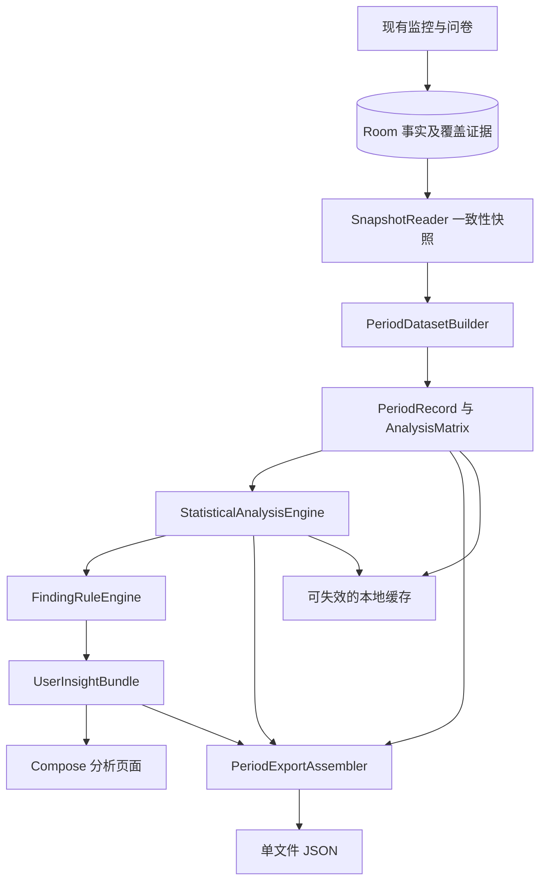

# PhoneMood 免费本地分析：High-Level Design

*English version: [FREE_ANALYSIS_HIGH_LEVEL_DESIGN.md](FREE_ANALYSIS_HIGH_LEVEL_DESIGN.md)*

状态：已接入 Android 1.4.0。更新日期：2026-09-06。三个模型、分析页及单文件 JSON 导出已实现；正式字段以 [导出2.0](PERIOD_EXPORT_SCHEMA.zh-CN.md) 为准，发布参数以 [统计策略1.0](ANALYSIS_POLICY_V1.zh-CN.md) 为准。下文保留设计推导，候选参数及阶段计划已由这两份实现规格收敛。

依据：[User Stories](FREE_TIER_USER_STORIES.zh-CN.md)、[周期导出设计](PERIOD_EXPORT_SCHEMA.zh-CN.md)、[JSON Schema](schemas/phonemood-period-v2.schema.json)。本设计扩展现有 Android 应用；原 [HIGH_LEVEL_DESIGN.md](HIGH_LEVEL_DESIGN.zh-CN.md) 继续描述记录、会话和问卷基础功能。

## 1. 交付目标

用户打开分析页面，直接看到应用根据已有手机使用记录和情绪评分得出的洞察。页面支持滚动 7 天／30 天，各自包含：

1. 手机使用总量、日均、典型范围和每日趋势。
2. 同一次会话内部，连续使用时间延长时的情绪变化倾向。
3. 最多三个有足够支持的 App 相比其他 App 的额外情绪变化倾向。

计算、筛选和解释全部本地执行：描述统计／基础回归 → 固定规则 → 中英文模板。用户可导出所选周期的一个自包含 JSON，供外部 AI 或统计工具分析。当前不开发会员、支付、AI 服务、聊天或云端上传。

## 2. 关键设计决定

最新产品调整：以有用的早期 tendency 为目标。20 次有效情绪评分启动可计算的基础关联分析，不要求 7 个有效日期、30 次评分或固定配对数，不用 p／FDR 显著性阻止初步结果展示。保留真实数据、计算正确性与“初步倾向”标签；完全无法估计时仍解释原因。当天展示当天数据，达到同一门槛时也可提供仅限当天的探索性关联。

| 项目 | 决定 |
|---|---|
| 数据来源 | Room 原始事实及已重建片段，不能拼接每日 JSON 作为分析源 |
| 周期 | 报告时区最近 7／30 个自然日，包含今天至快照时间 |
| 情绪归属 | 实际回答时间；旧日报仍按原口径，不静默改变 |
| 行为范围 | 近期 30 分钟特征保留导出；连续使用模型用会话内累计时长；App 模型用相邻实际回答之间的区间，不固定 30 分钟 |
| 单行样本 | 连续使用模型为按会话分组的评分观测；App 模型为一个有效前后评分配对 |
| 结果一致性 | 图表、文案、模型及导出共享同一个不可变周期快照 |
| 展示 | 核心发现、关键数字、小图表、支持程度、查看依据 |
| 缓存 | 派生数据可删除重算；不把统计结果作为 Room 事实表 |
| 省电 | 页面按需计算，不接入监控轮询，不新增息屏定时任务 |
| 不足与失败 | 每个分析主题独立状态，不因某个模型失败阻塞汇总或导出 |
| 发布边界 | schema 2.0 与统计策略 1.0 已冻结并随 Android 1.4.0 输出；历史草案单独归档 |

## 3. 总体架构



数据读取、特征构造、模型、规则与 UI 分层。统计核心只接收 Kotlin 数据对象，不持有 Context、DAO 或 Compose 状态，便于用固定样本验证。

## 4. 与现有工程的接入点

| 现有模块 | 本次变化 |
|---|---|
| `PhoneMoodApp` | 提供 AnalysisCoordinator、缓存和导出器的应用级实例 |
| `Repository` | 新增范围快照入口；统一分析相关写入的修订更新 |
| `Database.kt` | 新增范围 DAO、索引、覆盖证据；保留现有实体与数据 |
| `UsageMonitorService` | 沿用自适应轮询，只记录必要覆盖证据，不运行分析 |
| `SessionEngine` | 继续作为主动时间事实重建来源，不在本次替换计时算法 |
| `MoodNotificationManager` / `MoodOverlayController` | 送达、错过和展示变更参与快照修订，避免回答率缓存过期 |
| `MainActivity` | 新增“分析”入口及独立 ViewModel，不继续向根 Composable 堆积统计逻辑 |
| `DailyReportGenerator` | 原有日报保持兼容；新周期导出使用独立类 |
| `SettingsStore` | 保存上次选择的 7／30 天，仅为界面偏好 |

当前 `PhoneMoodScreen` 订阅全量片段、会话和回答，不适合作为统计计算触发源；新页面读取专用状态流。现有 Repository 每次 poll 重建历史属于独立性能问题，本次避免在其后再增加统计开销。

建议目录：

```text
analysis/
  model/             PeriodSnapshot、PeriodRecord、AnalysisRow、AnalysisState
  data/              SnapshotReader、PeriodDatasetBuilder、CoverageResolver
  statistics/        RegressionSolver、CovarianceEstimator、MultipleTesting
  models/            DailyTrendModel、WithinSessionMoodModel、AppExtraChangeModel
  rules/             AnalysisPolicy、FindingRuleEngine、InsightTemplateMapper
  cache/             AnalysisCache
  AnalysisCoordinator.kt
export/
  PeriodExportAssembler.kt
  PeriodExportValidator.kt
  PeriodJsonWriter.kt
ui/analysis/
  AnalysisViewModel.kt、AnalysisScreen.kt、InsightCard.kt
```

## 5. 事实快照与并发

### 5.1 读取流程

1. 进入页面、切换周期或主动刷新时，Coordinator 确定 period、报告时区和请求代号。
2. 如果需要补读事件，复用 Repository 的串行入口完成一次 reconcile；不与服务重复并发查询。失败时使用已有事实并标记未覆盖尾部。
3. 在短 Room 读事务中，读取监控状态与修订号、范围内片段、问卷／回答、配置、缺口、覆盖证据及最小上下文，形成不可变快照。快照不读取生成时刻之后的数据。
4. 退出事务和互斥锁后，在 `Dispatchers.Default` 构造特征、计算回归和规则。文件写入使用 `Dispatchers.IO`。
5. 结果只回填匹配请求代号和周期的页面；旧请求即便结束，也不能覆盖新周期。

不要在 Repository 的 mutex 或 Room 事务内拟合模型、生成 JSON 或等待文件选择器。快照与导出内存对象不能持有可变实体集合引用。

### 5.2 修订语义

当前 sourceRevision 每次成功 poll 都变化，不宜直接驱动每 10 秒重算。设计保留快照 sourceRevision 作为来源标识，另由协调层判断触发原因和节流。

实施时统一审计所有分析输入写入：回答、事件修正、配置、覆盖、通知首次送达、悬浮首次展示和错过状态。它们必须让分析快照失效；仅 UI 渲染不使其失效。Room 与 DataStore 不做跨库原子假设，分析配置以 Room 配置事实为准。

## 6. 覆盖证据与数据库迁移

目前只有 lastSuccessfulQueryUtc、心跳和 gap，无法可靠重建每个历史日期的完整性。新增独立的 `UsageCoverageEvidence` 事实表，建议 Room 2→3 非破坏性迁移：

| 字段 | 作用 |
|---|---|
| id | 确定性证据 ID |
| startUtc / endUtc | 该次证据支持的区间 |
| observedAtUtc | 何时取得证据 |
| outcome | 可用、未知、明确未监控 |
| reason | 权限关闭、暂停、恢复过晚、查询失败等 |
| evidenceVersion | 覆盖判断版本 |

成功读取 UsageStats 只是证据之一。CoverageResolver 还需结合监控开启区间、系统事件状态连续性、已知 gap、恢复边界及可解释的息屏区间，保守划分 VERIFIED／UNKNOWN／NOT_MONITORED。VERIFIED 表示满足应用定义的可用性证据，不能承诺系统没有遗漏任何事件。

同一范围可能多次补读；保留证据来源，Resolver 输出不重叠划分。明确暂停区间不被后续查询自动覆盖成 VERIFIED；无法消除冲突时为 UNKNOWN，并记录原因。升级前历史不回填为已验证：仍可展示已记录总量，但完整日统计与模型可能不足。

迁移增加时间范围查询索引：片段起止、回答时间、检查点时间、配置时间、覆盖证据起止。时间重叠条件为 `start < endBound AND end > startBound`，避免漏掉跨周期片段。迁移测试证明原有评分、问卷、会话及导出记录保留。

覆盖证据写入合并批次，不每个 poll 保留一条无限增长的成功记录；相邻同版本、同原因、兼容证据可合并，缺口不能被合并吞掉。合并仅压缩证据表示，不能提高可信度。

## 7. 周期构造与特征

### 7.1 描述统计

- 7／30 条 days 始终存在，今天截到快照时间。
- period total 与 App totals 来自裁切片段；零使用与无记录分开。
- 日均、中位数与 P25／P75 只用完整且结束的日期，同时保存实际日期列表与分母。
- 评分均值只用周期内实际回答，不混入只在周期内触发的迟答。
- 回答率使用周期内首次送达的检查点 cohort，通知／悬浮展示去重，不能以所有检查点当分母。

### 7.2 分析矩阵

保留每次实际回答的 `[answer - 30min, answer)` 描述特征，用于 JSON 导出；不再把该窗口的总用时回归作为免费版主要模型。三个模型分别读取：

| 数据集 | 样本单位 | 主要字段 |
|---|---|---|
| DailyDataset | 一个完整结束日 | 真实日期索引、总主动分钟数 |
| SessionMoodDataset | 一个周期内实际回答，按会话分组 | observation_id、session_id、回答时间、评分、截至回答的会话累计主动分钟数 |
| AppTransitionDataset | 同会话内相邻实际回答的配对 | 起止 observation_id、起止评分、mood_delta、起止时间、elapsed_ms、区间总主动时间、逐 App 时间、非计入主动时间、覆盖、纳入状态与原因 |

App TransitionBuilder 只能用真实前后回答构造变化，不能从没有回答的检查点虚构基线，也不能用最后 30 分钟使用量解释更长区间的评分变化。连续使用模型不需要两个评分恰好相隔 30 分钟。

先按时间排序片段和回答，以扫描／窗口索引累加，避免对每条回答反复遍历全历史。窗口边界裁切，去重，不使用回答之后的片段或最终会话时长。App 显示名不参与聚合键。

近期观测特征需要的周期前片段最多 30 分钟；若周期内结束回答与周期前同会话回答形成有效 App transition，上下文扩展到该配对起点，受固定最大配对间隔约束。两种需求取必要范围并集，不复制全历史。transition 按结束回答归属周期，周期外片段独立写入 context，不进入周期用时汇总。连续使用模型只用周期内评分，但截至回答的会话累计量可包含会话在周期前的使用；导出保存此累计量及来源含义。所有被引用 ID 在单文件可解析。

切换数需要 raw_events 中的转换／中断证据，不能从相邻裁切片段盲猜。若当前来源不能证明，字段为 null，不能填零。它是辅助导出特征，本次不增加切换因素排行榜。

## 8. 本地统计引擎

### 8.1 共同执行流程

建模只使用已记录或可确定派生的数据。没有测得“当天自然心情”、睡眠、压力、线下活动或 App 内内容，不将它们当已知协变量；任何截距都是统计参数，不是无手机情境下的自然情绪。保留三个主要模型，不恢复参考材料的 60 分钟提醒时间窗口、30／40 次评分门槛或日固定效应主模型。

样本筛选 → 变量变化／矩阵检查 → 稳定求解 → 不确定性 → 实际范围比较 → 模型级状态与警示。模型失败返回结构化结果，不抛出导致全页失败的异常。

优先 QR，秩检查可用 SVD，不直接求 `(X'X)` 逆。数值库通过 Android 构建、包体和基准验证后确定；v1 只需小矩阵线性代数，不引入通用机器学习框架。中心化／缩放必须固定并导出原单位系数及协方差。

小样本稳健推断与按日聚类的细节由版本化 AnalysisPolicy 提供。原参考的 7–19 天 HC3、20 天及以上按日聚类仅作候选基线：HC3 不自动解决日内相关，7 天不能因为运行成功就标成稳定。具体小样本修正、自由度和展示门槛进入发布前数值验证。

### 8.2 每日使用趋势：一元最小二乘

完整日主动使用分钟数为 U_d，真实日期索引为 x_d：

```text
U_d = alpha + beta * x_d + error_d
beta_hat = sum((x_d - mean(x)) * (U_d - mean(U)))
           / sum((x_d - mean(x))^2)
period_change = beta_hat * (max(x) - min(x))
```

输出 beta（分钟／日）和拟合跨度内的 period_change（分钟）。缺失日保留真实距离；今天未结束不参加拟合。至少 3 个完整日尝试初步趋势，不依赖 20 次情绪评分。

方向依据 period_change 与预设最小展示幅度判断，不能把浮点误差写成趋势。讨论中的候选阈值为 `max(15 分钟, 0.1 × 日用时中位数)`，是待定稿的产品参数，不是统计定理。区间跨零不单独阻止显示早期 tendency。使用逐日删除重算检查是否由某一天主导。

### 8.3 连续使用与情绪：会话内回归

目标：同一次连续使用过程中，随着累计使用时间增加，情绪评分通常怎样变化？不把不同会话的起始心情差异解释成会话内下降。

对会话 s 的第 j 次回答，评分为 y_sj，累计主动使用分钟数为 L_sj：

```text
y_sj = alpha_s + beta * L_sj + error_sj
centered_y_sj = y_sj - mean_y_s
centered_L_sj = L_sj - mean_L_s
w_s = 1 / n_s

beta_hat = sum_s(w_s * sum_j(centered_L_sj * centered_y_sj))
           / sum_s(w_s * sum_j(centered_L_sj^2))
```

alpha_s 通过会话内中心化消除，是会话特定统计截距，不是实测起始心情，也不是“自然心情”。n_s 是该会话实际参与拟合的周期内观测数。权重让每个会话在平方损失中总权重相同，是产品定义的会话平衡权重，不是假定它等于逆误差方差。时长范围更大的会话仍可能提供更多斜率信息，需做删除会话检查。

进入条件是周期至少 20 次有效评分；仅一个评分、累计时长不变或相关累计行为不可用的会话不提供斜率信息，记录排除原因。实际贡献评分数、会话数和分母必须单独报告；不要求额外固定 20 个配对，也不声称 20 次评分一定足以估计。

输出 `session_mood_change(h) = h * beta_hat`（评分点）。实际会话内跨度支持时可用 h=30 分钟；否则只采用预先定义且被实际跨度支持的比较量，不外推长时使用。样本只来自某个周期或少量会话时，文案如实标注。

固定模板示意：

```text
SESSION_MOOD_LOWER_EARLY:
在同一次连续使用过程中，使用时间延长约 {minutes} 分钟时，
你的情绪评分倾向于低约 {points} 分。
```

这是会话内关联，不能排除同一会话中同时发生的疲劳、时段和其他因素。它不是“从开始使用前下降了多少”，因为第一张问卷之前未必有起始评分。

### 8.4 App 相比其他 App 的额外情绪变化

目标：同样使用手机，在起始情绪、总主动时间和两次回答间隔相近时，将其他 App 的部分时间换成目标 App，情绪变化是否额外偏高／偏低？区间长度不固定为 30 分钟。内部拟合结束评分，固定起始评分后以额外变化解释对比。

#### 8.4.1 样本与变量

同一会话内相邻实际回答构成一个 transition i：

- `delta_y_i = end_score - start_score`。
- `P_i`：两次实际回答之间的总主动使用分钟数。
- `A_ia`：同一区间目标 App a 的主动使用分钟数。
- `G_i`：两次实际回答之间的时间间隔（分钟）。
- `R_i = G_i - P_i`：可保留的派生描述量，可能包括锁屏、排除 App 等，不是纯休息。主模型使用 P、G，不同时加入 P、G、R。
- `y_start_i`、`y_end_i`：实测起始与结束评分；不得用会话均值或日均值填补缺失的起始评分。

不跨不同会话配对；同会话漏答后的较长区间按固定最大间隔筛选。不将变化简单除以 elapsed 后假定长短区间完全等价。覆盖不完整时，缺失时间不能充当可信 R。首个无基线回答保留，但不生成 transition。

#### 8.4.2 模型及核心参数

```text
y_end_i = alpha + rho * y_start_i + beta * P_i
          + delta_a * A_ia + eta * G_i + error_i
```

起始评分用于区分“原本评分就低”与“其后额外变化”，不代表它已解释全部混杂。等价变化量写法为：

```text
delta_y_i = alpha + (rho - 1) * y_start_i + beta * P_i
            + delta_a * A_ia + eta * G_i + error_i
```

相同样本、设计空间、权重且不额外约束／惩罚系数的最小二乘下，两种写法的 delta_a 与其对比相同；只有起始评分系数相差 1。原 HLD 用 P、R 的参数化与当前 P、G 等价，因为 R=G-P；其中系数会重参数化，App 对比不变。不能把这些等价关系推广到不同样本、不同正则化或不同时间窗口。

核心量 delta_a（评分点／分钟）表示目标 App 相对其他 App 的额外变化。令 `O_i = P_i - A_ia`，则：

```text
beta * P_i + delta_a * A_ia
= beta * O_i + (beta + delta_a) * A_ia

extra_mood_change(h) = h * delta_a
```

解释为在 P、起始评分、G 固定时，将其他 App 的 h 分钟换为目标 App 的评分变化对比。起始评分相同，所以结束评分差等于前后变化量之差。其余 App 是用户实际使用的合并比较组，不代表与每一个其他 App 分别比较；包括目标 App 的全手机平均也不等于这个其他 App 基线。

G 的线性项调整间隔长度的条件均值，不意味着 rho 已成为随时间变化的连续时间情绪持续性参数。v1 仍限制过长配对并检查间隔分布；不把 20 分钟与隔夜评分当作等价 lag。是否扩展为连续时间模型不在本次范围。

#### 8.4.3 求解与可识别性

v1 使用确定性的最小二乘。控制变量空间 `Z = [1, y_start, P, G]`，通过 QR／SVD 残差化：

```text
r_A = A - Projection_Z(A)
r_y = y_end - Projection_Z(y_end)
delta_hat = dot(r_A, r_y) / dot(r_A, r_A)
```

P 或 G 恒定、二者相等或控制变量间存在其他线性依赖时，使用 Z 的有效列空间；不能因此自动判定 App 系数不可估计。只有 App 剩余变化不足、实际样本／残差自由度不足等情况下返回 NOT_ESTIMABLE。有效秩、容差和控制变量依赖写入 diagnostics；不可识别的控制变量系数不能冒充唯一解。用 delta_y 替换 y_end 做同样残差化时，因 y_start 已在 Z 中，r_y 应一致，这是数值测试项。

估计出的参考预测依赖指定的 P、起始评分和 G，不将 alpha 解释成自然心情或“平时平均下降”。若展示绝对预测变化，应在相同且可行的参考条件下计算 `predicted_end_score - reference_start_score`。预测超出评分尺度可行范围时，不通过截断伪装可信结论。

#### 8.4.4 样本门槛、比较量与固定模板

- 至少 20 次有效评分启动尝试，另报告实际 transition 数、会话数、日期数与模型秩；不额外规定必须有 20 个配对，但也不制造缺失配对。
- App 必须有重复曝光和可比较的使用变化；具体候选门槛集中版本化。
- h 根据实际支持的替换范围决定，不固定为 30。只有数分钟的目标 App 记录时，不能外推完整 30 分钟替换。控制变量相近的容差与支持范围算法需要在开发模型前固定。
- 有可用标准误时，`SE(extra) = abs(h) * SE(delta_hat)`；p／FDR 保留供复核，不是早期展示硬门槛。
- 导出区分模型 `outcome=END_MOOD_SCORE` 与发现 `contrast_outcome=EXTRA_MOOD_CHANGE`，并记录 window=BETWEEN_ANSWERS、delta_hat、h、额外评分差、控制条件、配对与会话数量、支持状态；原始 delta_y 继续保留。不同 App 使用不同 h 时必须显式展示，不能把不同比较范围称为统一因果影响力。

固定模板：

```text
APP_EXTRA_CHANGE_LOWER_EARLY:
在使用时长和起始情绪相近的记录中，更多时间用于 {app} 时，
情绪评分呈现额外下降的倾向。

APP_EXTRA_CHANGE_COMPARISON:
将其他 App 的约 {minutes} 分钟使用换成 {app}，
对应的评分变化额外{direction}约 {points} 分。
```

所有文本由规则选模板并填值；不确定比较条件得到支持时，不显示数值替换结论。该结果是观察性关联，不是 App 或 App 内具体内容的因果影响。

#### 8.4.5 预定义的时段敏感性模型

主结果使用上述五列模型（截距、起始评分、P、A、G）。当有效样本、残差自由度和时段分布满足预先固定条件时，在同一批样本上增加：

```text
sin(2*pi*local_hour/24) + cos(2*pi*local_hour/24)
```

local_hour 固定为结束回答在报告时区的小数小时；不得在起点、中点、终点之间挑结果。跨度和日期分布足够时，另一个预定义扩展可增加 centered_day；不默认将全部变量塞入 20 次评分的小样本。

启用条件仅依据输入覆盖、样本与设计可估计性，在看模型结果前决定；具体阈值集中版本化。同样的 h 用于比较主模型与敏感性模型。不以哪个 p 值较小或差异较大决定 headline，不自动用敏感性模型替换主结果。

有效敏感性模型与主模型方向明显冲突时，标记 `TIME_ADJUSTMENT_SENSITIVE` 并使用“这一倾向在考虑使用时段后不一致”的固定模板；调整后不可估计与方向冲突分别记录。敏感性模型未运行时，不声称已控制时段或慢趋势。v1 不引入日固定效应，也不将日期截距解释为自然情绪。

### 8.5 三个模型共用的确定性影响检查

每日趋势逐日删除重算。情绪模型在至少 3 个实际观测日期时逐日删除；日期不足但至少 3 个会话时逐会话删除；都不足时保留可估计结果并标为缺少跨块验证。

每次删除后重建中心化、权重或控制投影，但保持原比较量 h。会话内模型删除后成为单点的会话不再贡献斜率。无法估计的删除结果计入失败，不能从分母移除而夸大一致性。

```text
R = 与完整样本同方向且超过近零阈值的删除结果数 / 删除块总数
```

候选 R>=0.8 可标为方向较一致的初步倾向；该值是待固定的产品规则，不是 80% 置信度。不满足则使用“倾向暂不一致”的固定模板。每日模型的近零单位为分钟，情绪模型为评分点。对可估计 App 对比计算的 BH FDR 只供内部／导出，不用于阻止早期结果。

建议共同状态：INSUFFICIENT_DATA、NOT_ESTIMABLE、NO_NOTICEABLE_TENDENCY、MIXED_TENDENCY、EARLY_HIGHER、EARLY_LOWER。此为模型／规则状态，正式 schema 需明确映射，不能直接写入旧枚举而声称校验兼容。

App Top 3 先按支持程度分组，再按该组实际范围内 abs(extra_mood_change) 降序、实际样本数降序、稳定 App ID 升序排序。h 随发现输出。没有结果不填充，不将最大点估计叫作“最有害 App”。

## 9. 规则引擎与策略边界

`FindingRuleEngine` 只接收模型与质量结果，输出模板键、方向、量级、支持程度、展示资格和固定排序。UI 不重新判断显著性或排名。

已确定：每日趋势、会话内情绪回归、App 额外变化三个主要模型；30 分钟近期特征保留导出，App 使用相邻回答区间；各周期独立、最多三个 App、不足不填充、非因果解释、所有文案本地化。以下尚需在实现统计模块前集中固定，不能分散在 UI：

| 策略 | 本设计要求 |
|---|---|
| 前次评分 | 最大间隔、跨日规则、迟答上限；拒绝跨越很长间隔却仍当普通前次评分 |
| 行为质量 | 模型要求相应累计量／配对区间可用；App 仅纳入 COMPLETE 区间，不完整数据保留供导出 |
| 比较支持 | 会话内跨度、App 替换量 h、控制条件相近范围、残差秩与近零容差 |
| 时间敏感性 | sin／cos 及慢日期趋势的预定义启用条件；固定同一批样本、同一 h 与冲突模板，不按结果选模型 |
| 日期质量 | 完整结束日方可参与日均与趋势 |
| 数值检查 | 秩、最小暴露变化、条件数、最小残差自由度 |
| 推断 | HC3／聚类具体算法、t 自由度、相关性与敏感性验证 |
| 方向与展示 | 近零范围、量级及初步标注；区间跨零或 FDR 未达标不单独阻止早期展示 |
| 七天结果 | 可展示符合规则的早期关联，不要求先满 14 天；不可把短样本叫稳定 |

从原参考继承 0.2／0.4／0.8 评分点量级可作为候选产品阈值，但不作为临床标准。每个实际运行结果附完整 policy_snapshot 和 analysis_version。正式1.0参数已冻结并通过合成数值测试；历史开发样例的NOT_RUN不代表当前实现状态。

## 10. 分析页面与状态

现有底部栏是 Today／Timeline／Reports／Settings。建议加入独立“分析”页，与记录和日报区分；保留原页面入口。

```text
分析                 [过去 7 天] [过去 30 天]
日期范围 · 完整记录天数 · 更新时间     [导出 JSON]

使用时间与趋势
核心发现 / 日均与典型范围 / 每日图 / 查看依据

连续使用与情绪
会话内倾向或明确不足 / 对比值 / 支持程度 / 查看依据

App 的额外情绪变化
最多 3 个 App 洞察 / 无结果原因 / 查看依据

固定说明：根据自己的记录分析关联，不证明因果
```

ViewModel 对外提供 Loading、Content、Error；Content 内每个主题独立为 READY／EARLY／INSUFFICIENT_DATA／NO_CLEAR_PATTERN／NOT_ESTIMABLE／ERROR。更新时可继续显示同周期旧快照，明确“正在更新”；切周期不沿用旧周期卡片。

“查看依据”显示窗口、样本、覆盖、比较范围和方法简介；不展示 p 值、矩阵等术语。图表和模板都使用同一结果对象，英文／中文切换不重新运行统计。复用现有 `values-zh`，不因参考文件的 `values-zh-rCN` 另造重复语言体系。

## 11. 缓存、刷新与电量

缓存键包含：周期长度、报告时区、周期边界／asOf、来源修订、calculation_version、analysis_version。不能只有 sourceRevision：即使没有新事件，跨午夜或进行中尾部变化也会改变结果。

触发策略：

- 首次进入、切周期、主动刷新：请求相应快照。
- 新评分、配置、事件修正等重要变化：页面可见时短暂去抖后更新。
- 普通服务 heartbeat：只标记可更新，不随每次 poll 拟合；页面可见时最多约每分钟检查一次，后台停止页面刷新计时器。
- 跨报告日期：页面恢复或前台刷新时重建周期。
- 导出：固定当前页面已展示快照，保留其生成时间；不在文件选择器等待期间替换数据。用户可先刷新再导出最新状态。

首版内存最多保留当天／7／30 天三个最新结果；进程退出可重算。若基准表明需要磁盘缓存，再使用私有目录 AtomicFile 写入并按版本清理；不新增周期后台 Job。取消页面计算不能取消监控写事务。

性能验收目标（待实机测量，不是已达到）：常见 30 天样本页面首算约 2 秒内；大样本可持续显示进度并取消；主线程不执行数据库扫描或回归。记录阶段与分析阶段分别测 CPU、内存、耗时，不用查询次数估算省电幅度。

## 12. 单文件 JSON 导出

流程：页面固定快照 → Assembler 合并事实／特征／统计／说明 → 业务一致性校验 → 私有临时 JSON → 成功后保存或分享。

使用 kotlinx.serialization 与明确 DTO，UTF-8，拒绝非有限数。数据字典内嵌，不附带 ZIP、CSV 或独立说明文件。导出内容和来源修订须在整个对象一致。

保存使用 Android 文档创建入口，MIME `application/json`；分享使用 FileProvider content URI 和临时只读授权。选择器取消不报失败；写入失败尽力删除不完整目标并告知用户，不能显示导出成功。文件成功生成前不开放分享。

导出契约已升级为正式 `2.0`：包含 transitions、会话累计观测、END_MOOD_SCORE 模型与 EXTRA_MOOD_CHANGE 对比、comparison_value／comparison_unit、逐块重算、逐模型样本与排除原因、可识别性诊断。旧 draft.2 及示例已独立归档。正式合成示例由实际 Kotlin 引擎生成。

已有日报不自动变成新周期文件。schema 使用新 record_type，与 Room 数据库版本、旧日报 schema 独立。schema 格式校验由开发／测试工具承担；Android 导出路径还必须验证业务不变量。

未来会员 AI 只能消费这一数据边界，当前没有 AI 客户端或网络上传实现。App 名称等外部文本是标签，不作为 AI 指令；不加入未采集的健康信息。

## 13. 一致性与异常处理

| 场景 | 行为 |
|---|---|
| 初装／少于 7 天 | 仍输出 7／30 天日期与已知汇总，回归显示不足 |
| 权限关闭／暂停 | 保留事实、标缺口；不把空数组解释为零使用 |
| 息屏后恢复 | 复用事件补读；成功恢复不因没有 heartbeat 就计为缺口 |
| 迟答／周期边界 | 以回答时间构造窗口，补最小上下文；不重复计入 |
| 时钟倒退／负延迟 | 保留原事实、标异常、相关模型排除；当前非负延迟 schema 需在发布前支持异常表达，不能钳成零 |
| 排除 App 配置变化 | 按事件当时规则解释，窗口跨变化加标记，不用当前列表重写过去 |
| 模型秩不足 | NOT_ESTIMABLE，保留描述统计、矩阵与导出 |
| 统计模块异常 | 对应主题 ERROR，其他主题和事实导出可用 |
| 导出期间新回答 | 文件继续使用固定快照，下次刷新再纳入 |
| 删除／清空数据 | 后续若实现此功能，应清缓存并阻止旧快照继续导出；本次不新增删除功能 |

## 14. 测试与分阶段交付

### 阶段 A：数据基础

范围 DAO、覆盖证据迁移、快照、周期裁切、描述统计、分析矩阵。验证跨日／DST／迟答、空日、锁屏、窗口片段合并、跨界会话累计、配置变化、缺失与零、重复 ID。没有足够来源证据时必须降级。

### 阶段 B：本地统计与规则

先冻结 AnalysisPolicy 与数值方法，固定三个模型的合成参考结果；新增测试：不同会话基线但会话内零变化应得到零斜率、总时长恒定但 App 剩余变化存在仍可估计、目标 App 被控制变量完全解释时不可估计、前后变化与行为同区间、缺少基线不构造 transition。验证结束评分／变化量和 P+G／P+R 参数化得到同一 App 对比，时段敏感性冲突不会触发挑选更强模型，未运行调整时文案不虚称已调整。测试低方差、共线性、不规则配对、日内相关、FDR、少于三个 App、固定排序及七天早期状态。将类型／公式／样本／单位写入统计导出。

### 阶段 C：分析体验与单文件导出

独立 ViewModel、卡片、图表、依据页面、中英模板与格式化、JSON 保存／分享。对同一快照检查 UI 参数与 JSON 一致；在飞行模式、进程重启、权限撤回和取消导出场景验收。

### 阶段 D：发布

schema 正式版、异常时间和 policy 字段已冻结；schema 引用、时长、样本、覆盖、模型矩阵维度等业务校验已完成。APK 构建、单元测试、lint、数据库迁移及设备回归已通过，1.4.0 安装包位于 dist。

每阶段均以可验证产物结束；A–D 已完成，免费分析版本按本地确定性实现交付。

## 15. 首版决策已收敛

1. 覆盖证据、配对上限、迟答阈值、小样本推断和稳定性数值已固定在 [统计策略 1.0](ANALYSIS_POLICY_V1.zh-CN.md)，并由合成数据与迁移测试覆盖。
2. 数值库使用 Android 构建验证过的 Commons Math SVD；范围特征使用端点积分索引，避免每条回答重复扫描全部历史。
3. schema 2.0 已补齐 transition、会话内模型与 App 额外变化、可变比较量、影响检查、时钟异常、覆盖证据和逐模型状态。
4. 页面、单文件导出和双语固定模板已随 Android 1.4.0 交付；历史草案仍保留以便追溯，不作为当前契约。


代码位于 `analysis/PeriodDataset.kt`、`StatisticalEngine.kt`、`PeriodExport.kt` 与 `ui/AnalysisScreen.kt`。Room升级到3，新增覆盖证据与范围索引，保留原有数据。页面可见时按分钟刷新，并合并新评分／配置变更触发；离开页面停止计算，不增加后台分析任务。区间特征用端点积分索引计算，回归使用缩放SVD。

首版运行时段sin／cos敏感性模型；centered_day漂移扩展未加入，导出明确记录且不声称已调整。正式保存为一个JSON，支持系统文档选择器及FileProvider分享。所有展示为预置中英文模板。具体数值和schema已从候选阶段收敛至上述正式规格。
